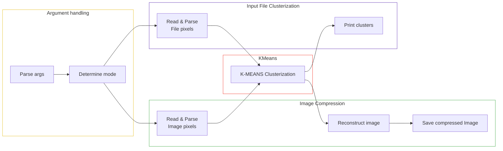

## Image Compressor

An implementation of the **K-means clustering algorithm** for image compression done in **OCaml**.
Inspired by the same project done during the second year at **Epitech**, originally written in Haskell for the **Functional Programming** course.

This version reproduces the core **pixel clustering** functionality and also includes actual image compression, which was a **bonus** feature in the original assignment.

<table align="center">
  <tr>
    <td></td>
    <td></td>
    <td></td>
  </tr>
  <tr align="center">
    <td><i>Original</i></td>
    <td><i>k = 10</i></td>
    <td><i>k = 3</i></td>
  </tr>
</table>

<br>

For other examples see [this directory](/examples/)


## Usage

**Steps**

1. Clone this repository and open it

2. **Compile** the program with the command

```
make
```

3. Then you can use it as specified here :

For **image** compression

```
USAGE: ./imageCompressor [OPTIONS] -k K <input_image_filepath> [<output_filepath>]

    OPTIONS:
            -h       display this message

    ARGS:
            K                       number of colors in the final image

            <output_filepath>       optional path/name for the compressed image
                                    Default: overwrites input image
```

**Examples**

`$ ./imageCompressor -k 3 my_photo.jpg`

`$ ./imageCompressor -k 10 my_photo.png ~/Documents/compressed_photo`


<br>

For **pixel clusterization** (the input file should contain points and colors).

Here are some [input files examples](/examples/text-inputs/)

```
USAGE: ./imageCompressor [OPTIONS] -n N -l L -f F

    OPTIONS:
            -h       display this message

    ARGS:
            N       number of colors in the final image
            L       convergence limit
            F       path to the file containing the colors of the pixels
```
**Example**

`$ ./imageCompressor -n 3 -l 0.2 -f input.txt`

## Diagram

Here's a small **flowchart** representing how the program works.

