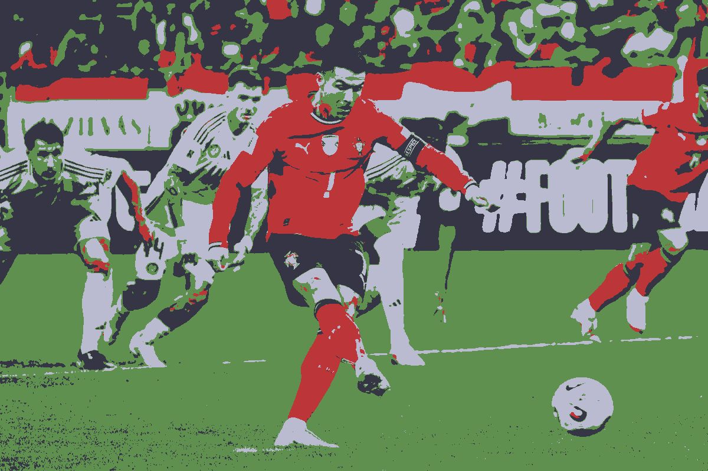

# Image clusterization - Example

Here's a pic of one of the best athletes of our time, [Cristiano Ronaldo](https://en.wikipedia.org/wiki/Cristiano_Ronaldo). (I've always been a [FCB](https://img.rts.ch/medias/2009/image/nium1i-27968659.image?w=1200&h=630) supporter though ^^).

Here's the original picture:

Here are the clustered images, and their respective number of colors :

**K = 2**
 

**K = 3**
 

**K = 4**
 

**K = 5**
 

**K = 10**
 

**K = 12**
 

